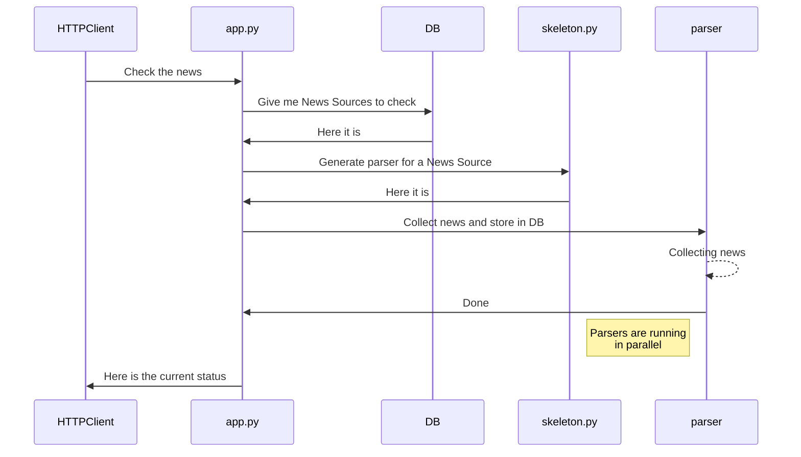

# Python Parser

This is a news aggregator, written on Python and posted on github for the code review.

## Files and folders

 - app.py - web-server on Flask. Listens for HTTP request to start the parsing
 - skeleton.py - standard template for news parser. Implements reusable code and connection to the database, where the parsed news are stored.
 - scripts (folder) - contains parser files. Each file takes care of a single News Source.
Currently folder "scripts" contains 20+ parsers. 
Parser naming convention: 
 1. Prefix "partial_"
 2. (number) - news source number from the DB
 3. Suffix ".py"
Example: "partial_14.py"

## Sequence diagram of the process

